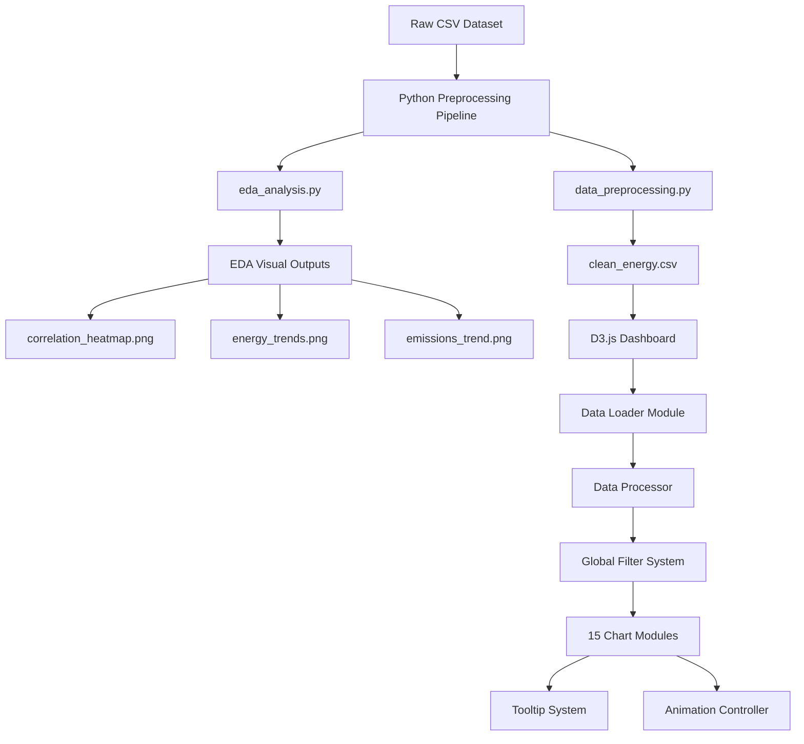

# Design Document: Energy Transition Analytics Dashboard

## Overview

The Energy Transition Analytics Dashboard is a comprehensive web-based data visualization system built with D3.js v7 and Python data preprocessing. The system enables interactive analysis of global energy production, consumption, and emissions data from 2000-2019.

### System Objectives

- Provide professional-grade interactive visualizations for energy transition analysis
- Enable filtering and exploration across countries and time periods
- Maintain performance with smooth animations and responsive updates
- Support academic research and policy analysis use cases
- Demonstrate CLO-5 level competency in interactive data visualization

### Key Design Principles

1. **Modularity**: Separate concerns into reusable components (data loading, tooltips, charts)
2. **Performance**: Efficient data aggregation and smooth 500ms transitions
3. **Consistency**: Centralized configuration for colors, animations, and styling
4. **Robustness**: Graceful handling of missing data and edge cases
5. **Accessibility**: Dark theme with sufficient contrast and clear labeling
6. **Deployability**: Pure front-end architecture compatible with GitHub Pages

### Technology Stack

- **Data Preprocessing**: Python 3.x with pandas, numpy, matplotlib, seaborn
- **Visualization**: D3.js v7 (loaded via CDN)
- **Frontend**: Vanilla JavaScript (ES6 modules), HTML5, CSS3
- **Deployment**: GitHub Pages (static hosting, no backend)
- **Data Format**: CSV files processed by Python, consumed by D3.js

## Architecture

### High-Level System Architecture



### Module Organization

```
project/
├── data/
│   ├── raw_energy_data.csv          # Original dataset
│   └── clean_energy.csv             # Processed dataset
├── preprocessing/
│   ├── data_preprocessing.py        # Data cleaning pipeline
│   ├── eda_analysis.py              # Exploratory analysis
│   └── outputs/
│       ├── correlation_heatmap.png
│       ├── energy_trends.png
│       ├── emissions_trend.png
│       └── distributions.png
├── js/
│   ├── config.js                    # Color schemes, constants
│   ├── dataLoader.js                # CSV loading and parsing
│   ├── utils.js                     # Aggregation, formatting
│   ├── tooltip.js                   # Reusable tooltip system
│   ├── filters.js                   # Country/year filter logic
│   └── charts/
│       ├── globalEnergyTrend.js     # Chart 1
│       ├── co2EmissionsTrend.js     # Chart 2
│       ├── electricityDemandGen.js  # Chart 3
│       ├── energyMixStacked.js      # Chart 4
│       ├── electricitySource.js     # Chart 5
│       ├── fossilBreakdown.js       # Chart 6
│       ├── renewableBreakdown.js    # Chart 7
│       ├── lowCarbonTrend.js        # Chart 8
│       ├── topConsumers.js          # Chart 9
│       ├── perCapitaUsage.js        # Chart 10
│       ├── countryComparison.js     # Chart 11
│       ├── gdpEnergyCorrelation.js  # Chart 12
│       ├── energyEmissionsCorr.js   # Chart 13
│       ├── renewableGrowth.js       # Chart 14
│       └── carbonIntensity.js       # Chart 15
├── css/
│   └── styles.css                   # Dark theme styling
├── index.html                       # Main dashboard page
└── report/
    └── project_report.md            # CLO-5 documentation
```

### Data Flow Architecture

1. **Preprocessing Stage** (Python):
   - Load raw CSV → Validate schema → Handle missing values
   - Filter to 2000-2019 → Create derived metrics → Save clean CSV
   - Generate EDA visualizations → Extract insights → Document findings

2. **Loading Stage** (JavaScript):
   - Fetch clean_energy.csv → Parse with D3.csv()
   - Type conversion → Data validation → Build indexes

3. **Filter Stage**:
   - User interaction → Update filter state → Trigger data aggregation
   - Broadcast to all charts → Coordinate animations

4. **Rendering Stage**:
   - Aggregate filtered data → Transform for visualization
   - Render D3 elements → Apply animations → Enable tooltips

5. **Interaction Stage**:
   - Hover events → Show tooltips → Update feedback
   - Filter changes → Re-aggregate → Smooth transitions

## Components and Interfaces

### Python Preprocessing Components

#### 1. Data Preprocessing Module (`data_preprocessing.py`)


**Purpose**: Clean and transform raw CSV data into analysis-ready format

**Interface**:
```python
def load_raw_data(filepath: str) -> pd.DataFrame:
    """Load raw CSV with proper encoding"""
    pass

def handle_missing_values(df: pd.DataFrame) -> pd.DataFrame:
    """
    Strategy:
    - Remove rows with >50% missing values
    - Impute numeric columns with interpolation for time series continuity
    - Document decisions in comments
    """
    pass

def convert_numeric_columns(df: pd.DataFrame) -> pd.DataFrame:
    """Convert specified columns to float64, coerce errors to NaN"""
    pass

def filter_year_range(df: pd.DataFrame, start: int, end: int) -> pd.DataFrame:
    """Filter dataset to specified year range (2000-2019)"""
    pass

def remove_sparse_columns(df: pd.DataFrame, threshold: float = 0.7) -> pd.DataFrame:
    """Remove columns with >30% missing data"""
    pass

def standardize_column_names(df: pd.DataFrame) -> pd.DataFrame:
    """Convert to snake_case, remove special characters"""
    pass

def create_derived_metrics(df: pd.DataFrame) -> pd.DataFrame:
    """
    Create calculated fields:
    - total_energy = coal + oil + gas + renewables
    - fossil_share = fossil_fuel_consumption / total_energy
    - renewable_share = renewables_consumption / total_energy
    - low_carbon_energy = renewables_consumption + nuclear_consumption
    """
    pass

def save_clean_data(df: pd.DataFrame, output_path: str):
    """Save processed dataset as clean_energy.csv"""
    pass

def main():
    """Execute preprocessing pipeline"""
    df = load_raw_data('data/raw_energy_data.csv')
    df = handle_missing_values(df)
    df = convert_numeric_columns(df)
    df = filter_year_range(df, 2000, 2019)
    df = remove_sparse_columns(df)
    df = standardize_column_names(df)
    df = create_derived_metrics(df)
    save_clean_data(df, 'data/clean_energy.csv')
    print(f"Preprocessing complete: {len(df)} records, {len(df.columns)} columns")
```

**Key Design Decisions**:
- Use pandas interpolation for time series data (preserves trends)
- Remove columns with >30% missing values (insufficient for analysis)
- Create derived metrics to support dashboard requirements
- Document all transformations for reproducibility

#### 2. EDA Analysis Module (`eda_analysis.py`)

**Purpose**: Generate insights and visualizations for CLO-5 documentation

**Interface**:
```python
def load_clean_data(filepath: str) -> pd.DataFrame:
    """Load preprocessed dataset"""
    pass

def descriptive_statistics(df: pd.DataFrame) -> dict:
    """Calculate mean, median, std, min, max for key variables"""
    pass

def trend_analysis(df: pd.DataFrame) -> dict:
    """
    Analyze trends:
    - Global energy consumption over time
    - Emissions trajectory
    - Renewable growth rate
    Returns: dict with trend descriptions
    """
    pass

def correlation_analysis(df: pd.DataFrame) -> pd.DataFrame:
    """
    Compute correlation matrix for:
    - energy_per_capita, gdp, emissions, renewables_share, carbon_intensity
    Save heatmap as correlation_heatmap.png
    """
    pass

def distribution_analysis(df: pd.DataFrame):
    """
    Generate histograms for:
    - energy_per_capita
    - greenhouse_gas_emissions
    - gdp
    Save as distributions.png (subplot grid)
    """
    pass

def plot_energy_trends(df: pd.DataFrame):
    """
    Line plot: fossil vs renewable vs nuclear over time
    Save as energy_trends.png
    """
    pass

def plot_emissions_trend(df: pd.DataFrame):
    """
    Line plot: global emissions over time with trend line
    Save as emissions_trend.png
    """
    pass

def generate_insights(df: pd.DataFrame, stats: dict, corr: pd.DataFrame) -> list:
    """
    Extract 5-8 key insights:
    - "Fossil fuel consumption dominates early years but declines after 2015"
    - "Renewable energy shows X% CAGR from 2000-2019"
    - "GDP and energy consumption are strongly correlated (r=X.XX)"
    - "Top 10 countries account for X% of global emissions"
    Returns: list of insight strings
    """
    pass

def main():
    """Execute EDA pipeline"""
    df = load_clean_data('data/clean_energy.csv')
    stats = descriptive_statistics(df)
    corr = correlation_analysis(df)
    distribution_analysis(df)
    plot_energy_trends(df)
    plot_emissions_trend(df)
    insights = generate_insights(df, stats, corr)
    
    print("=== EDA INSIGHTS ===")
    for insight in insights:
        print(f"- {insight}")
```

**Visualization Specifications**:
- Use seaborn style 'darkgrid' for consistency
- Save at 300 DPI for report quality
- Include clear titles, axis labels, and legends
- Use color palette compatible with dashboard theme

### JavaScript Core Components

#### 3. Configuration Module (`config.js`)

**Purpose**: Centralized constants and color schemes

**Interface**:
```javascript
export const CONFIG = {
  colors: {
    // Energy sources
    coal: '#6b7280',      // Gray
    oil: '#f97316',       // Orange
    gas: '#3b82f6',       // Blue
    renewables: '#10b981', // Green
    nuclear: '#8b5cf6',   // Purple
    
    // Metrics
    emissions: '#ef4444', // Red
    demand: '#f59e0b',    // Amber
    generation: '#06b6d4', // Cyan
    lowCarbon: '#10b981', // Green gradient
    
    // Correlation/intensity gradients
    intensityLow: '#10b981',
    intensityHigh: '#ef4444',
    
    // UI
    background: '#0b0f1a',
    panel: '#111827',
    text: '#e5e7eb',
    textMuted: '#9ca3af',
    border: '#1f2937',
    hover: '#1f2937'
  },
  
  animation: {
    duration: 500,
    easing: d3.easeCubicInOut
  },
  
  chart: {
    margin: { top: 40, right: 30, bottom: 60, left: 70 },
    minHeight: 300,
    aspectRatio: 1.5
  },
  
  tooltip: {
    offset: { x: 10, y: -20 },
    showDelay: 100,
    hideDelay: 100
  },
  
  data: {
    yearRange: [2000, 2019],
    topN: 10,
    topNPerCapita: 15,
    decimalPlaces: 2
  }
};
```

#### 4. Data Loader Module (`dataLoader.js`)

**Purpose**: Load and parse CSV data with type conversion

**Interface**:
```javascript
export async function loadEnergyData(filepath = 'data/clean_energy.csv') {
  try {
    const data = await d3.csv(filepath, row => ({
      country: row.country,
      year: +row.year,
      population: +row.population || null,
      gdp: +row.gdp || null,
      coal_consumption: +row.coal_consumption || 0,
      oil_consumption: +row.oil_consumption || 0,
      gas_consumption: +row.gas_consumption || 0,
      renewables_consumption: +row.renewables_consumption || 0,
      nuclear_consumption: +row.nuclear_consumption || 0,
      fossil_fuel_consumption: +row.fossil_fuel_consumption || 0,
      greenhouse_gas_emissions: +row.greenhouse_gas_emissions || null,
      electricity_demand: +row.electricity_demand || null,
      electricity_generation: +row.electricity_generation || null,
      carbon_intensity_elec: +row.carbon_intensity_elec || null,
      energy_per_capita: +row.energy_per_capita || null,
      total_energy: +row.total_energy || 0,
      fossil_share: +row.fossil_share || 0,
      renewable_share: +row.renewable_share || 0,
      low_carbon_energy: +row.low_carbon_energy || 0
    }));
    
    // Filter to year range
    const filtered = data.filter(d => d.year >= 2000 && d.year <= 2019);
    
    console.log(`Loaded ${filtered.length} records from ${new Set(filtered.map(d => d.country)).size} countries`);
    return filtered;
    
  } catch (error) {
    console.error('Data loading failed:', error);
    throw new Error('Failed to load energy data. Please check the data file.');
  }
}

export function validateData(data) {
  if (!data || data.length === 0) {
    throw new Error('No data loaded');
  }
  
  const requiredFields = ['country', 'year'];
  const missingFields = requiredFields.filter(field => 
    !data[0].hasOwnProperty(field)
  );
  
  if (missingFields.length > 0) {
    throw new Error(`Missing required fields: ${missingFields.join(', ')}`);
  }
  
  return true;
}
```

**Error Handling Strategy**:
- Try-catch around d3.csv() call
- Display user-friendly error message in UI
- Log detailed error to console for debugging
- Return null values for missing numeric fields (handled downstream)

#### 5. Utility Functions Module (`utils.js`)

**Purpose**: Data aggregation and formatting helpers

**Interface**:
```javascript
// Aggregate data across countries for "All Countries" view
export function aggregateByYear(data, metric) {
  const grouped = d3.group(data, d => d.year);
  return Array.from(grouped, ([year, rows]) => ({
    year,
    value: d3.sum(rows, d => d[metric] || 0)
  })).sort((a, b) => a.year - b.year);
}

// Filter data by country (or all if country === 'All Countries')
export function filterByCountry(data, country) {
  if (country === 'All Countries') {
    return data;
  }
  return data.filter(d => d.country === country);
}

// Filter data by year range
export function filterByYearRange(data, minYear, maxYear) {
  return data.filter(d => d.year >= minYear && d.year <= maxYear);
}

// Get unique countries sorted alphabetically
export function getUniqueCountries(data) {
  return ['All Countries', ...Array.from(new Set(data.map(d => d.country))).sort()];
}

// Format large numbers with K/M/B suffixes
export function formatNumber(num, decimals = 2) {
  if (num === null || num === undefined) return 'N/A';
  
  const absNum = Math.abs(num);
  if (absNum >= 1e9) return (num / 1e9).toFixed(decimals) + 'B';
  if (absNum >= 1e6) return (num / 1e6).toFixed(decimals) + 'M';
  if (absNum >= 1e3) return (num / 1e3).toFixed(decimals) + 'K';
  return num.toFixed(decimals);
}

// Format percentage
export function formatPercent(num, decimals = 1) {
  if (num === null || num === undefined) return 'N/A';
  return num.toFixed(decimals) + '%';
}

// Calculate year-over-year growth rate
export function calculateGrowthRate(data, metric) {
  const sorted = [...data].sort((a, b) => a.year - b.year);
  const result = [];
  
  for (let i = 1; i < sorted.length; i++) {
    const prev = sorted[i - 1][metric];
    const curr = sorted[i][metric];
    
    if (prev && curr && prev !== 0) {
      result.push({
        year: sorted[i].year,
        growthRate: ((curr - prev) / prev) * 100
      });
    }
  }
  
  return result;
}

// Aggregate multiple metrics for comparison
export function aggregateMultipleMetrics(data, metrics) {
  return metrics.map(metric => ({
    metric,
    value: d3.mean(data, d => d[metric]) || 0
  }));
}
```

#### 6. Tooltip System Module (`tooltip.js`)

**Purpose**: Reusable tooltip component for all charts

**Interface**:
```javascript
class Tooltip {
  constructor(containerId) {
    this.tooltip = d3.select('body')
      .append('div')
      .attr('class', 'tooltip')
      .style('position', 'absolute')
      .style('visibility', 'hidden')
      .style('background-color', CONFIG.colors.panel)
      .style('color', CONFIG.colors.text)
      .style('border', `1px solid ${CONFIG.colors.border}`)
      .style('border-radius', '4px')
      .style('padding', '10px')
      .style('font-size', '13px')
      .style('pointer-events', 'none')
      .style('z-index', '1000')
      .style('box-shadow', '0 4px 6px rgba(0, 0, 0, 0.3)');
  }
  
  show(content, event) {
    this.tooltip
      .style('visibility', 'visible')
      .html(content);
    
    this.updatePosition(event);
  }
  
  hide() {
    this.tooltip.style('visibility', 'hidden');
  }
  
  updatePosition(event) {
    const tooltipNode = this.tooltip.node();
    const tooltipWidth = tooltipNode.offsetWidth;
    const tooltipHeight = tooltipNode.offsetHeight;
    
    let left = event.pageX + CONFIG.tooltip.offset.x;
    let top = event.pageY + CONFIG.tooltip.offset.y;
    
    // Prevent tooltip from going off-screen
    if (left + tooltipWidth > window.innerWidth) {
      left = event.pageX - tooltipWidth - CONFIG.tooltip.offset.x;
    }
    
    if (top + tooltipHeight > window.innerHeight) {
      top = event.pageY - tooltipHeight - Math.abs(CONFIG.tooltip.offset.y);
    }
    
    this.tooltip
      .style('left', left + 'px')
      .style('top', top + 'px');
  }
  
  formatContent(data) {
    // Helper to format tooltip HTML
    return Object.entries(data)
      .map(([key, value]) => `<strong>${key}:</strong> ${value}`)
      .join('<br/>');
  }
}

export { Tooltip };
```

**Positioning Algorithm**:
1. Default: offset right and up from cursor
2. If tooltip would overflow right edge: flip to left of cursor
3. If tooltip would overflow bottom edge: flip above cursor
4. Ensure minimum 10px margin from viewport edges

#### 7. Filter System Module (`filters.js`)

**Purpose**: Manage global filter state and coordinate updates

**Interface**:
```javascript
class FilterManager {
  constructor() {
    this.state = {
      country: 'All Countries',
      yearRange: [2000, 2019]
    };
    this.listeners = [];
  }
  
  // Subscribe to filter changes
  subscribe(callback) {
    this.listeners.push(callback);
  }
  
  // Notify all subscribers
  notifyListeners() {
    this.listeners.forEach(callback => callback(this.state));
  }
  
  // Update country filter
  setCountry(country) {
    this.state.country = country;
    this.notifyListeners();
  }
  
  // Update year range filter
  setYearRange(min, max) {
    this.state.yearRange = [min, max];
    this.notifyListeners();
  }
  
  // Initialize UI controls
  initCountryDropdown(data, selectId) {
    const countries = getUniqueCountries(data);
    const select = d3.select(`#${selectId}`);
    
    select.selectAll('option')
      .data(countries)
      .join('option')
      .attr('value', d => d)
      .text(d => d);
    
    select.on('change', (event) => {
      this.setCountry(event.target.value);
    });
  }
  
  initYearSlider(sliderId, labelId) {
    const slider = document.getElementById(sliderId);
    const label = document.getElementById(labelId);
    
    // Initialize noUiSlider (or custom implementation)
    slider.addEventListener('change', (event) => {
      const [min, max] = event.target.value.split(',').map(Number);
      this.setYearRange(min, max);
      label.textContent = `${min} - ${max}`;
    });
  }
}

export { FilterManager };
```

**State Management Strategy**:
- Centralized filter state in FilterManager
- Observer pattern for chart updates
- Debounce slider updates (100ms) to prevent excessive re-renders
- Synchronize all chart animations via shared timing

## Data Models

### Primary Data Structure (Post-Preprocessing)

```typescript
interface EnergyRecord {
  // Identifiers
  country: string;
  year: number;
  
  // Demographic & Economic
  population: number | null;
  gdp: number | null;
  
  // Energy Consumption by Source (TWh)
  coal_consumption: number;
  oil_consumption: number;
  gas_consumption: number;
  renewables_consumption: number;
  nuclear_consumption: number;
  fossil_fuel_consumption: number;
  
  // Environmental Impact
  greenhouse_gas_emissions: number | null;  // Mt CO2eq
  carbon_intensity_elec: number | null;     // gCO2/kWh
  
  // Electricity Metrics (TWh)
  electricity_demand: number | null;
  electricity_generation: number | null;
  
  // Per Capita Metrics
  energy_per_capita: number | null;         // kWh per person
  
  // Derived Metrics (calculated in preprocessing)
  total_energy: number;                     // Sum of all sources
  fossil_share: number;                     // Percentage
  renewable_share: number;                  // Percentage
  low_carbon_energy: number;                // renewables + nuclear
}
```

### Aggregated Data Structures

```typescript
// Time series aggregation
interface TimeSeriesPoint {
  year: number;
  value: number;
}

// Multi-metric aggregation
interface MetricComparison {
  metric: string;
  value: number;
  unit?: string;
}

// Country ranking
interface CountryRank {
  country: string;
  value: number;
  rank: number;
}

// Correlation data point
interface CorrelationPoint {
  country: string;
  x: number;
  y: number;
  size?: number;
  color?: number;
}

// Composition breakdown
interface CompositionSlice {
  category: string;
  value: number;
  percentage: number;
  color: string;
}
```

### Filter State Model

```typescript
interface FilterState {
  country: 'All Countries' | string;
  yearRange: [number, number];  // [min, max]
}
```

## D3.js Visualization Designs


### Chart 1: Global Energy Consumption Trend

**D3 Chart Type**: Line chart (d3.line())

**Data Transformation**:
```javascript
function prepareData(rawData, filterState) {
  const filtered = filterByCountry(rawData, filterState.country);
  const inRange = filterByYearRange(filtered, ...filterState.yearRange);
  
  if (filterState.country === 'All Countries') {
    return aggregateByYear(inRange, 'total_energy');
  } else {
    return inRange.map(d => ({ year: d.year, value: d.total_energy }))
      .sort((a, b) => a.year - b.year);
  }
}
```

**Scale Configuration**:
```javascript
const xScale = d3.scaleLinear()
  .domain(d3.extent(data, d => d.year))
  .range([0, width]);

const yScale = d3.scaleLinear()
  .domain([0, d3.max(data, d => d.value) * 1.1])
  .range([height, 0]);
```

**Color Mapping**: `CONFIG.colors.renewables` (green) for energy trend

**Tooltip Content**:
```javascript
tooltip.show(`
  <strong>Year:</strong> ${d.year}<br/>
  <strong>Total Energy:</strong> ${formatNumber(d.value)} TWh
`, event);
```

**Animation Strategy**:
- Initial render: Line draws from left to right over 500ms
- Filter update: Morph existing path to new data using d3.transition()
- Hover: Highlight data point with circle (100ms fade-in)

**Responsive Sizing**:
- Container width: 100% of parent
- Height: Maintain 1.5:1 aspect ratio
- Mobile (<768px): Reduce margins, adjust font sizes

---

### Chart 2: CO₂ Emissions Trend

**D3 Chart Type**: Line chart (d3.line()) with area fill

**Data Transformation**:
```javascript
function prepareData(rawData, filterState) {
  const filtered = filterByCountry(rawData, filterState.country);
  const inRange = filterByYearRange(filtered, ...filterState.yearRange);
  
  if (filterState.country === 'All Countries') {
    return aggregateByYear(inRange, 'greenhouse_gas_emissions');
  } else {
    return inRange.map(d => ({ 
      year: d.year, 
      value: d.greenhouse_gas_emissions || 0 
    })).sort((a, b) => a.year - b.year);
  }
}
```

**Scale Configuration**:
```javascript
const xScale = d3.scaleTime()
  .domain(d3.extent(data, d => d.year))
  .range([0, width]);

const yScale = d3.scaleLinear()
  .domain([0, d3.max(data, d => d.value) * 1.1])
  .range([height, 0]);
```

**Color Mapping**: `CONFIG.colors.emissions` (red) with 0.3 opacity for area fill

**Tooltip Content**:
```javascript
tooltip.show(`
  <strong>Year:</strong> ${d.year}<br/>
  <strong>Emissions:</strong> ${formatNumber(d.value)} Mt CO₂eq
`, event);
```

**Animation Strategy**:
- Area morphs smoothly between filter states
- Gradient fill from red to transparent
- Clip-path reveal for initial render

---

### Chart 3: Electricity Demand vs Generation

**D3 Chart Type**: Dual-line chart

**Data Transformation**:
```javascript
function prepareData(rawData, filterState) {
  const filtered = filterByCountry(rawData, filterState.country);
  const inRange = filterByYearRange(filtered, ...filterState.yearRange);
  
  const demandData = filterState.country === 'All Countries'
    ? aggregateByYear(inRange, 'electricity_demand')
    : inRange.map(d => ({ year: d.year, value: d.electricity_demand }));
    
  const genData = filterState.country === 'All Countries'
    ? aggregateByYear(inRange, 'electricity_generation')
    : inRange.map(d => ({ year: d.year, value: d.electricity_generation }));
    
  return { demand: demandData, generation: genData };
}
```

**Scale Configuration**:
```javascript
const allValues = [...demandData, ...genData].map(d => d.value).filter(v => v != null);
const yMax = d3.max(allValues);

const yScale = d3.scaleLinear()
  .domain([0, yMax * 1.1])
  .range([height, 0]);
```

**Color Mapping**:
- Demand: `CONFIG.colors.demand` (amber)
- Generation: `CONFIG.colors.generation` (cyan)

**Tooltip Content**:
```javascript
tooltip.show(`
  <strong>Year:</strong> ${d.year}<br/>
  <strong>${metric}:</strong> ${formatNumber(d.value)} TWh
`, event);
```

**Legend Design**:
- Horizontal layout at top-right
- Line samples with labels
- 20px spacing between items

---

### Chart 4: Fossil vs Renewable vs Nuclear Energy Mix

**D3 Chart Type**: Stacked area chart (d3.stack(), d3.area())

**Data Transformation**:
```javascript
function prepareData(rawData, filterState) {
  const filtered = filterByCountry(rawData, filterState.country);
  const inRange = filterByYearRange(filtered, ...filterState.yearRange);
  
  const byYear = d3.rollup(
    inRange,
    v => ({
      fossil: d3.sum(v, d => d.fossil_fuel_consumption),
      renewables: d3.sum(v, d => d.renewables_consumption),
      nuclear: d3.sum(v, d => d.nuclear_consumption || 0)
    }),
    d => d.year
  );
  
  return Array.from(byYear, ([year, values]) => ({ year, ...values }))
    .sort((a, b) => a.year - b.year);
}
```

**Stack Configuration**:
```javascript
const stack = d3.stack()
  .keys(['fossil', 'renewables', 'nuclear'])
  .order(d3.stackOrderNone)
  .offset(d3.stackOffsetNone);

const series = stack(data);
```

**Color Mapping**:
- Fossil: `CONFIG.colors.coal` (gray)
- Renewables: `CONFIG.colors.renewables` (green)
- Nuclear: `CONFIG.colors.nuclear` (purple)

**Tooltip Content**:
```javascript
tooltip.show(`
  <strong>Year:</strong> ${d.data.year}<br/>
  <strong>${key}:</strong> ${formatNumber(d[1] - d[0])} TWh<br/>
  <strong>Total:</strong> ${formatNumber(d[1])} TWh
`, event);
```

**Animation Strategy**:
- Stagger animation: Each layer animates with 100ms delay
- Y-position interpolation for smooth stacking updates

---

### Chart 5: Electricity Source Composition

**D3 Chart Type**: Stacked bar chart

**Data Transformation**:
```javascript
function prepareData(rawData, filterState) {
  const filtered = filterByCountry(rawData, filterState.country);
  const inRange = filterByYearRange(filtered, ...filterState.yearRange);
  
  // Sample years at 5-year intervals
  const years = Array.from(new Set(inRange.map(d => d.year)))
    .filter(y => y % 5 === 0)
    .sort();
  
  return years.map(year => {
    const yearData = inRange.filter(d => d.year === year);
    return {
      year,
      coal: d3.sum(yearData, d => d.coal_consumption),
      oil: d3.sum(yearData, d => d.oil_consumption),
      gas: d3.sum(yearData, d => d.gas_consumption),
      renewables: d3.sum(yearData, d => d.renewables_consumption),
      nuclear: d3.sum(yearData, d => d.nuclear_consumption || 0)
    };
  });
}
```

**Scale Configuration**:
```javascript
const xScale = d3.scaleBand()
  .domain(data.map(d => d.year))
  .range([0, width])
  .padding(0.2);

const yScale = d3.scaleLinear()
  .domain([0, 100])  // Percentage
  .range([height, 0]);
```

**Normalization**:
```javascript
data.forEach(d => {
  const total = d.coal + d.oil + d.gas + d.renewables + d.nuclear;
  if (total > 0) {
    d.coal_pct = (d.coal / total) * 100;
    d.oil_pct = (d.oil / total) * 100;
    // ... etc
  }
});
```

**Color Mapping**: Use CONFIG.colors for each source

**Tooltip Content**:
```javascript
tooltip.show(`
  <strong>Year:</strong> ${d.data.year}<br/>
  <strong>${source}:</strong> ${formatPercent(percentage)}
`, event);
```

---

### Chart 6: Fossil Fuel Breakdown

**D3 Chart Type**: Pie chart (d3.pie(), d3.arc())

**Data Transformation**:
```javascript
function prepareData(rawData, filterState) {
  const filtered = filterByCountry(rawData, filterState.country);
  const inRange = filterByYearRange(filtered, ...filterState.yearRange);
  
  return [
    { type: 'Coal', value: d3.sum(inRange, d => d.coal_consumption) },
    { type: 'Oil', value: d3.sum(inRange, d => d.oil_consumption) },
    { type: 'Gas', value: d3.sum(inRange, d => d.gas_consumption) }
  ];
}
```

**Arc Configuration**:
```javascript
const pie = d3.pie()
  .value(d => d.value)
  .sort(null);

const arc = d3.arc()
  .innerRadius(0)
  .outerRadius(Math.min(width, height) / 2 - 20);

const labelArc = d3.arc()
  .innerRadius(radius * 0.7)
  .outerRadius(radius * 0.7);
```

**Color Mapping**:
- Coal: `CONFIG.colors.coal`
- Oil: `CONFIG.colors.oil`
- Gas: `CONFIG.colors.gas`

**Tooltip Content**:
```javascript
const total = d3.sum(data, d => d.value);
const percentage = (d.value / total) * 100;

tooltip.show(`
  <strong>${d.data.type}:</strong> ${formatNumber(d.value)} TWh<br/>
  <strong>Percentage:</strong> ${formatPercent(percentage)}
`, event);
```

**Label Placement**:
- Show percentage labels only if slice > 5%
- Position at labelArc centroid
- White text with drop shadow for contrast

**Animation Strategy**:
- Enter: Grow from center (scale 0 to 1)
- Update: Interpolate arc angles with d3.interpolate
- Exit: Shrink to center

---

### Chart 7: Renewable Energy Breakdown

**D3 Chart Type**: Pie/Donut chart

**Data Transformation**:
```javascript
function prepareData(rawData, filterState) {
  const filtered = filterByCountry(rawData, filterState.country);
  const inRange = filterByYearRange(filtered, ...filterState.yearRange);
  
  // Assuming renewables_consumption includes subcategories
  // If not available, display message
  const data = [
    { type: 'Solar', value: d3.sum(inRange, d => d.solar_consumption || 0) },
    { type: 'Wind', value: d3.sum(inRange, d => d.wind_consumption || 0) },
    { type: 'Hydro', value: d3.sum(inRange, d => d.hydro_consumption || 0) },
    { type: 'Other', value: d3.sum(inRange, d => d.other_renewables || 0) }
  ];
  
  const total = d3.sum(data, d => d.value);
  if (total < 0.01) {
    return null;  // Insufficient data
  }
  
  return data.filter(d => d.value > 0);
}
```

**Donut Configuration**:
```javascript
const arc = d3.arc()
  .innerRadius(radius * 0.5)
  .outerRadius(radius);
```

**Color Mapping**:
- Solar: `#fbbf24` (yellow)
- Wind: `#38bdf8` (light blue)
- Hydro: `#10b981` (green)
- Other: `#6ee7b7` (light green)

**Insufficient Data Handling**:
```javascript
if (!data) {
  container.append('text')
    .attr('text-anchor', 'middle')
    .attr('dy', '0.35em')
    .text('Renewable breakdown data not available')
    .style('fill', CONFIG.colors.textMuted);
}
```

---

### Chart 8: Low-Carbon Energy Trend

**D3 Chart Type**: Area chart with gradient fill

**Data Transformation**:
```javascript
function prepareData(rawData, filterState) {
  const filtered = filterByCountry(rawData, filterState.country);
  const inRange = filterByYearRange(filtered, ...filterState.yearRange);
  
  return aggregateByYear(inRange, 'low_carbon_energy');
}
```

**Gradient Definition**:
```javascript
const gradient = svg.append('defs')
  .append('linearGradient')
  .attr('id', 'low-carbon-gradient')
  .attr('x1', '0%')
  .attr('y1', '0%')
  .attr('x2', '0%')
  .attr('y2', '100%');

gradient.append('stop')
  .attr('offset', '0%')
  .attr('stop-color', CONFIG.colors.lowCarbon)
  .attr('stop-opacity', 0.8);

gradient.append('stop')
  .attr('offset', '100%')
  .attr('stop-color', CONFIG.colors.lowCarbon)
  .attr('stop-opacity', 0.1);
```

**Area Configuration**:
```javascript
const area = d3.area()
  .x(d => xScale(d.year))
  .y0(height)
  .y1(d => yScale(d.value))
  .curve(d3.curveMonotoneX);
```

**Animation Strategy**:
- Clip-path reveal from left to right
- Line animates before area fill

---

### Chart 9: Top Energy Consumers by Year

**D3 Chart Type**: Horizontal bar chart

**Data Transformation**:
```javascript
function prepareData(rawData, filterState) {
  const targetYear = filterState.yearRange[1];  // Most recent year
  const yearData = rawData.filter(d => d.year === targetYear);
  
  return yearData
    .map(d => ({
      country: d.country,
      value: d.total_energy
    }))
    .sort((a, b) => b.value - a.value)
    .slice(0, CONFIG.data.topN);
}
```

**Scale Configuration**:
```javascript
const xScale = d3.scaleLinear()
  .domain([0, d3.max(data, d => d.value)])
  .range([0, width]);

const yScale = d3.scaleBand()
  .domain(data.map(d => d.country))
  .range([0, height])
  .padding(0.1);
```

**Color Mapping**: Single color with opacity variation based on rank

**Tooltip Content**:
```javascript
tooltip.show(`
  <strong>${d.country}</strong><br/>
  <strong>Rank:</strong> ${i + 1}<br/>
  <strong>Total Energy:</strong> ${formatNumber(d.value)} TWh
`, event);
```

**Animation Strategy**:
- Bars grow from left (width 0 to final width)
- Stagger delay: 30ms per bar
- Update: Bars transition positions and widths

---

### Chart 10: Per Capita Energy Usage

**D3 Chart Type**: Horizontal bar chart

**Data Transformation**:
```javascript
function prepareData(rawData, filterState) {
  const inRange = filterByYearRange(rawData, ...filterState.yearRange);
  
  const byCountry = d3.rollup(
    inRange,
    v => d3.mean(v, d => d.energy_per_capita),
    d => d.country
  );
  
  return Array.from(byCountry, ([country, avgPerCapita]) => ({
    country,
    value: avgPerCapita
  }))
    .filter(d => d.value != null)
    .sort((a, b) => b.value - a.value)
    .slice(0, CONFIG.data.topNPerCapita);
}
```

**Axis Labels**: Include units "(kWh per capita)"

---

### Chart 11: Country Comparison

**D3 Chart Type**: Grouped bar chart

**Data Transformation**:
```javascript
function prepareData(rawData, selectedCountries) {
  const metrics = ['total_energy', 'greenhouse_gas_emissions', 'renewable_share'];
  
  return selectedCountries.map(country => {
    const countryData = rawData.filter(d => d.country === country);
    return {
      country,
      total_energy: d3.mean(countryData, d => d.total_energy),
      greenhouse_gas_emissions: d3.mean(countryData, d => d.greenhouse_gas_emissions),
      renewable_share: d3.mean(countryData, d => d.renewable_share)
    };
  });
}
```

**Multi-Select Dropdown**:
```javascript
function initMultiSelect(containerId, data) {
  const countries = getUniqueCountries(data).slice(1);  // Exclude "All Countries"
  
  const select = d3.select(`#${containerId}`)
    .attr('multiple', true)
    .attr('size', 8);
  
  select.selectAll('option')
    .data(countries)
    .join('option')
    .attr('value', d => d)
    .text(d => d);
  
  select.on('change', function() {
    const selected = Array.from(this.selectedOptions).map(o => o.value);
    updateChart(selected.slice(0, 5));  // Max 5 countries
  });
}
```

**Grouped Bar Layout**:
```javascript
const x0 = d3.scaleBand()
  .domain(data.map(d => d.country))
  .range([0, width])
  .padding(0.1);

const x1 = d3.scaleBand()
  .domain(metrics)
  .range([0, x0.bandwidth()])
  .padding(0.05);
```

**Color Mapping**: Assign distinct colors from CONFIG per country

**Legend Design**: Show country names with color swatches

---

### Chart 12: GDP vs Energy Consumption Correlation

**D3 Chart Type**: Scatter plot (d3.scaleLog for GDP)

**Data Transformation**:
```javascript
function prepareData(rawData, filterState) {
  const inRange = filterByYearRange(rawData, ...filterState.yearRange);
  
  const byCountry = d3.rollup(
    inRange,
    v => ({
      gdp: d3.mean(v, d => d.gdp),
      energy: d3.mean(v, d => d.total_energy),
      population: d3.mean(v, d => d.population),
      emissions: d3.mean(v, d => d.greenhouse_gas_emissions)
    }),
    d => d.country
  );
  
  return Array.from(byCountry, ([country, values]) => ({
    country,
    ...values
  })).filter(d => d.gdp != null && d.energy != null);
}
```

**Scale Configuration**:
```javascript
const xScale = d3.scaleLog()
  .domain(d3.extent(data, d => d.gdp))
  .range([0, width]);

const yScale = d3.scaleLinear()
  .domain([0, d3.max(data, d => d.energy)])
  .range([height, 0]);

const sizeScale = d3.scaleSqrt()
  .domain(d3.extent(data, d => d.population || 1))
  .range([3, 20]);
```

**Trend Line Calculation**:
```javascript
// Simple linear regression
const regression = d3.leastSquares(
  data.map(d => Math.log(d.gdp)),
  data.map(d => d.energy)
);

const trendLine = d3.line()
  .x(d => xScale(d.gdp))
  .y(d => yScale(regression(Math.log(d.gdp))));
```

**Tooltip Content**:
```javascript
tooltip.show(`
  <strong>${d.country}</strong><br/>
  <strong>GDP:</strong> $${formatNumber(d.gdp)}B<br/>
  <strong>Energy:</strong> ${formatNumber(d.energy)} TWh<br/>
  <strong>Population:</strong> ${formatNumber(d.population)}
`, event);
```

**Animation Strategy**:
- Circles fade in and grow from center
- Update: Circles transition x, y, and radius simultaneously

---

### Chart 13: Energy Consumption vs Emissions Correlation

**D3 Chart Type**: Scatter plot with color gradient

**Data Transformation**: Similar to Chart 12

**Color Scale Configuration**:
```javascript
const colorScale = d3.scaleSequential(d3.interpolateRdYlGn)
  .domain(d3.extent(data, d => d.carbon_intensity_elec).reverse());  // Reverse: high intensity = red
```

**Color Legend**:
```javascript
function renderColorLegend(svg, colorScale, width, height) {
  const legendWidth = 200;
  const legendHeight = 10;
  
  const legend = svg.append('g')
    .attr('class', 'color-legend')
    .attr('transform', `translate(${width - legendWidth - 10}, 10)`);
  
  const defs = svg.append('defs');
  const gradient = defs.append('linearGradient')
    .attr('id', 'intensity-gradient');
  
  gradient.selectAll('stop')
    .data(d3.range(0, 1.1, 0.1))
    .join('stop')
    .attr('offset', d => `${d * 100}%`)
    .attr('stop-color', d => colorScale(d3.min(colorScale.domain()) + d * (d3.max(colorScale.domain()) - d3.min(colorScale.domain()))));
  
  legend.append('rect')
    .attr('width', legendWidth)
    .attr('height', legendHeight)
    .style('fill', 'url(#intensity-gradient)');
  
  legend.append('text')
    .attr('x', 0)
    .attr('y', -5)
    .text('Carbon Intensity (gCO₂/kWh)')
    .style('font-size', '11px')
    .style('fill', CONFIG.colors.text);
}
```

---

### Chart 14: Renewable Energy Growth Rate

**D3 Chart Type**: Line chart with zero reference line

**Data Transformation**:
```javascript
function prepareData(rawData, filterState) {
  const filtered = filterByCountry(rawData, filterState.country);
  const inRange = filterByYearRange(filtered, ...filterState.yearRange);
  
  return calculateGrowthRate(inRange, 'renewables_consumption');
}
```

**Zero Reference Line**:
```javascript
svg.append('line')
  .attr('x1', 0)
  .attr('x2', width)
  .attr('y1', yScale(0))
  .attr('y2', yScale(0))
  .attr('stroke', CONFIG.colors.textMuted)
  .attr('stroke-width', 1)
  .attr('stroke-dasharray', '4,4');
```

**Color Mapping**:
- Positive growth: `CONFIG.colors.renewables` (green)
- Negative growth: `CONFIG.colors.emissions` (red)

**Conditional Coloring**:
```javascript
svg.selectAll('.growth-segment')
  .data(data)
  .join('circle')
  .attr('cx', d => xScale(d.year))
  .attr('cy', d => yScale(d.growthRate))
  .attr('r', 3)
  .attr('fill', d => d.growthRate >= 0 ? CONFIG.colors.renewables : CONFIG.colors.emissions);
```

---

### Chart 15: Carbon Intensity of Electricity

**D3 Chart Type**: Line chart with gradient fill

**Data Transformation**:
```javascript
function prepareData(rawData, filterState) {
  const filtered = filterByCountry(rawData, filterState.country);
  const inRange = filterByYearRange(filtered, ...filterState.yearRange);
  
  if (filterState.country === 'All Countries') {
    // Weighted average by electricity generation
    const byYear = d3.rollup(
      inRange,
      v => {
        const totalGen = d3.sum(v, d => d.electricity_generation || 0);
        const weightedIntensity = d3.sum(v, d => 
          (d.carbon_intensity_elec || 0) * (d.electricity_generation || 0)
        );
        return totalGen > 0 ? weightedIntensity / totalGen : null;
      },
      d => d.year
    );
    
    return Array.from(byYear, ([year, value]) => ({ year, value }))
      .filter(d => d.value != null)
      .sort((a, b) => a.year - b.year);
  } else {
    return inRange.map(d => ({
      year: d.year,
      value: d.carbon_intensity_elec
    })).filter(d => d.value != null);
  }
}
```

**Gradient Color (Dynamic)**:
```javascript
const gradient = svg.append('defs')
  .append('linearGradient')
  .attr('id', 'intensity-line-gradient')
  .attr('gradientUnits', 'userSpaceOnUse')
  .attr('x1', 0)
  .attr('y1', yScale(d3.max(data, d => d.value)))
  .attr('x2', 0)
  .attr('y2', yScale(d3.min(data, d => d.value)));

gradient.append('stop')
  .attr('offset', '0%')
  .attr('stop-color', CONFIG.colors.intensityHigh);

gradient.append('stop')
  .attr('offset', '100%')
  .attr('stop-color', CONFIG.colors.intensityLow);
```

**Axis Label**: "Carbon Intensity (gCO₂/kWh)"


## Error Handling

### Data Loading Errors

**Strategy**: Fail-fast with user feedback

```javascript
async function initDashboard() {
  try {
    const data = await loadEnergyData();
    validateData(data);
    renderDashboard(data);
  } catch (error) {
    displayErrorMessage(error.message);
    console.error('Dashboard initialization failed:', error);
  }
}

function displayErrorMessage(message) {
  const container = d3.select('#dashboard');
  container.html('')
    .append('div')
    .attr('class', 'error-message')
    .style('padding', '40px')
    .style('text-align', 'center')
    .style('color', CONFIG.colors.emissions)
    .html(`
      <h2>Error Loading Dashboard</h2>
      <p>${message}</p>
      <p>Please check the browser console for details.</p>
    `);
}
```

### Missing Data Handling

**Strategy**: Graceful degradation

```javascript
function handleMissingData(value, defaultValue = 0) {
  return value != null && !isNaN(value) ? value : defaultValue;
}

// In aggregation functions
function aggregateByYear(data, metric) {
  const grouped = d3.group(data, d => d.year);
  return Array.from(grouped, ([year, rows]) => ({
    year,
    value: d3.sum(rows, d => handleMissingData(d[metric], 0)),
    count: rows.filter(r => r[metric] != null).length
  })).filter(d => d.count > 0);  // Exclude years with no valid data
}
```

**Insufficient Data Messages**:
```javascript
function renderChart(data) {
  if (!data || data.length === 0) {
    container.append('text')
      .attr('class', 'no-data-message')
      .attr('x', width / 2)
      .attr('y', height / 2)
      .attr('text-anchor', 'middle')
      .style('fill', CONFIG.colors.textMuted)
      .style('font-size', '14px')
      .text('No data available for selected filters');
    return;
  }
  // ... render chart
}
```

### Division by Zero Protection

```javascript
function calculatePercentage(numerator, denominator) {
  if (denominator === 0 || denominator == null) {
    return 0;
  }
  return (numerator / denominator) * 100;
}

function calculateShare(part, total) {
  return total > 0 ? (part / total) : 0;
}
```

### Browser Compatibility Errors

**Strategy**: Check for required features

```javascript
function checkBrowserSupport() {
  const issues = [];
  
  if (!window.d3) {
    issues.push('D3.js failed to load');
  }
  
  if (!window.fetch) {
    issues.push('Fetch API not supported');
  }
  
  if (issues.length > 0) {
    alert(`Browser compatibility issues detected:\n${issues.join('\n')}\n\nPlease use a modern browser.`);
    return false;
  }
  
  return true;
}
```

### Data Quality Logging

**Strategy**: Log warnings without blocking

```javascript
function logDataQuality(data) {
  const totalRecords = data.length;
  
  const metrics = [
    'population', 'gdp', 'greenhouse_gas_emissions', 
    'carbon_intensity_elec', 'energy_per_capita'
  ];
  
  metrics.forEach(metric => {
    const nullCount = data.filter(d => d[metric] == null).length;
    const nullPct = (nullCount / totalRecords) * 100;
    
    if (nullPct > 30) {
      console.warn(`Data quality warning: ${metric} has ${nullPct.toFixed(1)}% missing values`);
    }
  });
}
```

## Testing Strategy

### Python Preprocessing Tests

**Unit Tests** (`test_preprocessing.py`):
```python
import unittest
import pandas as pd
from data_preprocessing import *

class TestPreprocessing(unittest.TestCase):
    
    def setUp(self):
        # Create sample data
        self.sample_data = pd.DataFrame({
            'country': ['USA', 'China', 'India'],
            'year': [2010, 2010, 2010],
            'coal_consumption': [100, 200, 50],
            'oil_consumption': [150, 100, 30],
            'gas_consumption': [80, 50, 20],
            'renewables_consumption': [20, 10, 5]
        })
    
    def test_create_derived_metrics(self):
        result = create_derived_metrics(self.sample_data)
        
        # Check total_energy calculation
        self.assertEqual(result.loc[0, 'total_energy'], 350)  # 100+150+80+20
        
        # Check renewable_share calculation
        self.assertAlmostEqual(result.loc[0, 'renewable_share'], 5.71, places=2)  # 20/350*100
    
    def test_filter_year_range(self):
        df = pd.DataFrame({
            'year': [1999, 2000, 2010, 2019, 2020]
        })
        result = filter_year_range(df, 2000, 2019)
        
        self.assertEqual(len(result), 3)
        self.assertTrue(all(result['year'] >= 2000))
        self.assertTrue(all(result['year'] <= 2019))
    
    def test_handle_missing_values(self):
        df = pd.DataFrame({
            'col1': [1, 2, None, 4],
            'col2': [None, None, None, None],
            'col3': [1, 2, 3, 4]
        })
        result = handle_missing_values(df)
        
        # Should remove col2 (100% missing)
        self.assertNotIn('col2', result.columns)
        
        # Should interpolate col1
        self.assertIsNotNone(result.loc[2, 'col1'])
```

**EDA Tests** (`test_eda.py`):
```python
def test_descriptive_statistics(self):
    stats = descriptive_statistics(self.clean_data)
    
    # Check required statistics exist
    self.assertIn('energy_per_capita', stats)
    self.assertIn('mean', stats['energy_per_capita'])
    self.assertIn('median', stats['energy_per_capita'])
    self.assertIn('std', stats['energy_per_capita'])

def test_correlation_analysis(self):
    corr = correlation_analysis(self.clean_data)
    
    # Check correlation matrix properties
    self.assertEqual(corr.shape[0], corr.shape[1])  # Square matrix
    self.assertTrue(all(corr.diagonal() == 1.0))  # Diagonal is 1
    
    # Check output file created
    self.assertTrue(os.path.exists('preprocessing/outputs/correlation_heatmap.png'))
```

### JavaScript Unit Tests

**Data Utilities Tests** (using Jest or Mocha):
```javascript
describe('Data Utilities', () => {
  
  test('aggregateByYear sums values correctly', () => {
    const data = [
      { year: 2010, country: 'USA', total_energy: 100 },
      { year: 2010, country: 'China', total_energy: 200 },
      { year: 2011, country: 'USA', total_energy: 110 }
    ];
    
    const result = aggregateByYear(data, 'total_energy');
    
    expect(result).toEqual([
      { year: 2010, value: 300 },
      { year: 2011, value: 110 }
    ]);
  });
  
  test('filterByCountry handles "All Countries"', () => {
    const data = [
      { country: 'USA' },
      { country: 'China' }
    ];
    
    const result = filterByCountry(data, 'All Countries');
    expect(result.length).toBe(2);
  });
  
  test('formatNumber handles large numbers', () => {
    expect(formatNumber(1500000)).toBe('1.50M');
    expect(formatNumber(2500)).toBe('2.50K');
    expect(formatNumber(25)).toBe('25.00');
  });
  
  test('calculateGrowthRate computes correctly', () => {
    const data = [
      { year: 2010, renewables: 100 },
      { year: 2011, renewables: 120 }
    ];
    
    const result = calculateGrowthRate(data, 'renewables');
    expect(result[0].growthRate).toBeCloseTo(20, 1);  // 20% growth
  });
});
```

### Integration Tests

**End-to-End Filter Test**:
```javascript
describe('Filter Integration', () => {
  
  test('Country filter updates all charts', async () => {
    const data = await loadEnergyData();
    const filterManager = new FilterManager();
    
    let updateCount = 0;
    filterManager.subscribe(() => updateCount++);
    
    filterManager.setCountry('USA');
    
    // All 15 charts should update
    expect(updateCount).toBe(1);
    expect(filterManager.state.country).toBe('USA');
  });
  
  test('Year range filter updates data correctly', () => {
    const data = [
      { year: 2000 }, { year: 2005 }, { year: 2010 }, { year: 2015 }
    ];
    
    const filtered = filterByYearRange(data, 2005, 2015);
    expect(filtered.length).toBe(3);
  });
});
```

### Manual Testing Checklist

**Visual Regression**:
- [ ] All 15 charts render without errors
- [ ] Dark theme applied consistently
- [ ] Tooltips appear near cursor without obscuring data
- [ ] Animations are smooth (no jank)
- [ ] Charts resize correctly on window resize
- [ ] Mobile layout stacks charts vertically

**Interaction Testing**:
- [ ] Country dropdown updates all charts within 500ms
- [ ] Year range slider updates all charts within 500ms
- [ ] Multi-select for country comparison works with 2-5 countries
- [ ] Hover tooltips display correct values
- [ ] Tooltips hide when cursor leaves chart
- [ ] Legend items are readable and correctly mapped

**Data Quality Testing**:
- [ ] Charts handle countries with missing data
- [ ] No data message appears for insufficient data
- [ ] Division by zero doesn't crash charts
- [ ] Large numbers formatted with K/M/B suffixes
- [ ] Percentages display with appropriate precision

**Performance Testing**:
- [ ] Dashboard loads within 3 seconds
- [ ] Filter updates complete within 500ms
- [ ] No memory leaks during extended use
- [ ] Browser console shows no errors

### Automated Visual Testing (Optional)

**Snapshot Testing with Puppeteer**:
```javascript
const puppeteer = require('puppeteer');

async function captureChartSnapshot(page, chartId) {
  const element = await page.$(`#${chartId}`);
  await element.screenshot({ path: `screenshots/${chartId}.png` });
}

describe('Visual Regression', () => {
  let browser, page;
  
  beforeAll(async () => {
    browser = await puppeteer.launch();
    page = await browser.newPage();
    await page.goto('http://localhost:8000/index.html');
    await page.waitForSelector('.chart');
  });
  
  test('Capture all chart snapshots', async () => {
    const chartIds = [
      'global-energy-trend',
      'co2-emissions',
      // ... all 15 charts
    ];
    
    for (const chartId of chartIds) {
      await captureChartSnapshot(page, chartId);
    }
  });
  
  afterAll(async () => {
    await browser.close();
  });
});
```

## Deployment

### GitHub Pages Deployment

**Steps**:
1. Push code to GitHub repository
2. Enable GitHub Pages in repository settings
3. Set source to main branch, root directory (or docs/ folder)
4. Access at `https://<username>.github.io/<repo-name>/`

**Configuration Requirements**:
- Use relative paths for all assets: `./data/clean_energy.csv`, `./js/config.js`
- Include D3.js via CDN in `index.html`:
  ```html
  <script src="https://d3js.org/d3.v7.min.js"></script>
  ```
- Ensure CORS doesn't block CSV loading (GitHub Pages serves with correct headers)

### File Structure for Deployment

```
repository/
├── index.html              # Entry point
├── data/
│   └── clean_energy.csv    # Preprocessed data
├── js/
│   ├── config.js
│   ├── dataLoader.js
│   ├── utils.js
│   ├── tooltip.js
│   ├── filters.js
│   └── charts/
│       └── [15 chart files]
├── css/
│   └── styles.css
├── preprocessing/
│   ├── data_preprocessing.py
│   ├── eda_analysis.py
│   └── outputs/
│       └── [EDA images]
├── report/
│   └── project_report.md
└── README.md
```

### Local Testing

**Option 1: Python HTTP Server**:
```bash
python -m http.server 8000
# Access at http://localhost:8000
```

**Option 2: VS Code Live Server Extension**:
- Install "Live Server" extension
- Right-click `index.html` → "Open with Live Server"

### Performance Optimization

**Data Loading**:
- Minify CSV file (remove unnecessary whitespace)
- Consider pre-aggregating global totals to reduce client-side computation

**Code Optimization**:
- Use D3 v7 tree-shaking if bundling with webpack (optional)
- Debounce filter updates to prevent excessive re-renders
- Lazy-load charts outside viewport (intersection observer)

**Caching**:
```html
<script src="https://d3js.org/d3.v7.min.js" 
        integrity="sha384-..." 
        crossorigin="anonymous"></script>
```

### Browser Compatibility

**Target Browsers**:
- Chrome/Edge 90+
- Firefox 88+
- Safari 14+

**Polyfills** (if supporting older browsers):
- Fetch API: `whatwg-fetch`
- Promises: `es6-promise`

**Feature Detection**:
```javascript
if (!window.d3) {
  alert('D3.js failed to load. Please check your internet connection.');
}
```

## Documentation Requirements

### Project Report Structure

**For CLO-5 Evaluation**:

1. **Dataset Understanding**
   - Source: [Kaggle/Our World in Data/etc.]
   - Rows: ~X,XXX records
   - Columns: XX variables
   - Time Range: 2000-2019
   - Geographic Coverage: XXX countries

2. **Data Preprocessing Steps**
   - Missing Value Strategy: Interpolation for time series, removal for >30% sparse columns
   - Feature Engineering: Created `total_energy`, `fossil_share`, `renewable_share`, `low_carbon_energy`
   - Column Selection Reasoning: Removed columns X, Y, Z due to sparsity
   - Year Filtering: Limited to 2000-2019 for consistency

3. **EDA Summary (5-8 Key Insights)**
   - "Global energy consumption increased by X% from 2000-2019"
   - "Fossil fuels dominate early period but decline after 2015"
   - "Renewable energy shows X% CAGR over study period"
   - "Strong positive correlation (r=X.XX) between GDP and energy consumption"
   - "Top 10 countries account for X% of global emissions"
   - "Carbon intensity of electricity decreasing globally at X% per year"
   - "[Additional insights from EDA]"

4. **EDA Visualizations**
   - Include correlation_heatmap.png
   - Include energy_trends.png
   - Include emissions_trend.png
   - Include distribution plots
   - Caption each image with key takeaways

5. **Visualization Design Choices**
   - Dark theme for reduced eye strain and professional aesthetic
   - Interactive filters for exploratory analysis
   - 15 complementary chart types addressing different analytical questions
   - Smooth animations for context preservation during updates

6. **Technical Implementation**
   - Python preprocessing with pandas ensures data quality
   - D3.js v7 for flexible, performant visualizations
   - Modular architecture for maintainability
   - Pure frontend design for easy deployment (GitHub Pages)

7. **Challenges and Solutions**
   - Challenge: Missing data across metrics
     - Solution: Interpolation for time series, graceful fallbacks in visualizations
   - Challenge: Performance with large datasets
     - Solution: Pre-aggregation in Python, efficient D3 updates
   - Challenge: Coordinating 15 chart updates
     - Solution: Observer pattern with FilterManager

8. **Future Enhancements**
   - Add country clustering based on energy profiles
   - Implement forecast models for renewable growth
   - Add export functionality for filtered data
   - Integrate real-time data updates

### Code Documentation

**Function Documentation Template**:
```javascript
/**
 * Aggregates data by year for a specific metric across all countries.
 * 
 * @param {Array<EnergyRecord>} data - The filtered energy dataset
 * @param {string} metric - The metric field to aggregate (e.g., 'total_energy')
 * @returns {Array<TimeSeriesPoint>} Array of { year, value } objects sorted by year
 * 
 * @example
 * const trend = aggregateByYear(data, 'renewables_consumption');
 * // Returns: [{ year: 2000, value: 1234 }, { year: 2001, value: 1300 }, ...]
 */
function aggregateByYear(data, metric) {
  // Implementation
}
```

### README.md Contents

```markdown
# Energy Transition Analytics Dashboard

Interactive D3.js visualization dashboard analyzing global energy trends from 2000-2019.

## Features

- 15 interactive visualizations covering energy consumption, emissions, and correlations
- Country and year range filtering
- Responsive dark theme design
- Professional-grade analytics capabilities

## Setup

1. **Preprocess Data**:
   ```bash
   cd preprocessing
   python data_preprocessing.py
   python eda_analysis.py
   ```

2. **Run Locally**:
   ```bash
   python -m http.server 8000
   ```
   Open http://localhost:8000 in browser

3. **Deploy to GitHub Pages**:
   - Push to GitHub
   - Enable Pages in settings
   - Access at https://<username>.github.io/<repo>/

## Technologies

- **Frontend**: D3.js v7, Vanilla JavaScript (ES6), HTML5, CSS3
- **Preprocessing**: Python 3.x, pandas, numpy, matplotlib, seaborn
- **Deployment**: GitHub Pages

## Project Structure

See DESIGN.md for detailed architecture documentation.

## License

MIT
```


## Correctness Properties

*A property is a characteristic or behavior that should hold true across all valid executions of a system—essentially, a formal statement about what the system should do. Properties serve as the bridge between human-readable specifications and machine-verifiable correctness guarantees.*

### Applicability of Property-Based Testing

This dashboard includes two distinct types of logic:

**PBT-Applicable Components**:
- Python preprocessing functions (pure data transformations)
- JavaScript data utilities (aggregation, filtering, formatting)
- Calculation functions (derived metrics, percentages)

**Non-PBT Components**:
- D3.js visualization rendering (UI output, not testable via PBT)
- Interactive UI components (dropdowns, sliders - integration testing)
- Animation and transitions (visual QA, not quantifiable)

The correctness properties below focus on the pure data processing logic where PBT provides value.

### Property 1: Year Range Filtering Correctness

*For any* dataset and any year range [minYear, maxYear] where minYear ≤ maxYear, all records returned by filterByYearRange() SHALL have year values satisfying minYear ≤ year ≤ maxYear, and no records within the range SHALL be excluded.

**Validates: Requirements 1.5, 3.4**

### Property 2: Country Filtering Correctness

*For any* dataset and any country name:
- WHEN filtering by a specific country, all returned records SHALL have that exact country value and no matching records SHALL be excluded
- WHEN filtering by "All Countries", all records from the dataset SHALL be returned unchanged

**Validates: Requirements 2.5, 4.3**

### Property 3: Aggregation Correctness with Null Handling

*For any* dataset and any numeric metric, when aggregating by year:
- The aggregated value for each year SHALL equal the sum of all non-null metric values for that year
- Null or undefined values SHALL be excluded from the sum without causing errors
- Years with zero non-null values SHALL be filtered from the result

**Validates: Requirements 4.2, 7.2, 23.2**

### Property 4: Country Extraction Produces Unique Sorted List

*For any* dataset, extracting the list of unique countries SHALL produce:
- A list containing each distinct country exactly once (no duplicates)
- Countries sorted in alphabetical ascending order
- "All Countries" as the first element when included

**Validates: Requirements 2.2**

### Property 5: Stack Layer Summation Invariant

*For any* stacked area or bar chart data with multiple energy sources, at each year position, the sum of all layer values (fossil + renewables + nuclear) SHALL equal the total_energy value for that year within a tolerance of 0.01%.

**Validates: Requirements 7.6**

### Property 6: Defensive Data Handling Never Crashes

*For any* dataset containing invalid values (null, undefined, NaN, infinity, or zero denominators):
- All data processing functions SHALL complete without throwing errors
- Invalid numeric values SHALL be coerced to null or 0 as appropriate
- Division operations with zero denominators SHALL return null or 0 (never Infinity or NaN)
- Functions SHALL continue processing remaining valid data

**Validates: Requirements 1.4, 23.1, 23.4**

### Property 7: Derived Metrics Calculation Correctness

*For any* energy record with valid source consumption values:
- total_energy SHALL equal coal_consumption + oil_consumption + gas_consumption + renewables_consumption + nuclear_consumption
- fossil_share SHALL equal (fossil_fuel_consumption / total_energy) × 100 when total_energy > 0
- renewable_share SHALL equal (renewables_consumption / total_energy) × 100 when total_energy > 0
- low_carbon_energy SHALL equal renewables_consumption + nuclear_consumption

**Validates: Requirements (preprocessing derived metrics)**

### Property 8: Format Functions Preserve Meaning

*For any* numeric value:
- formatNumber() SHALL preserve the order of magnitude (K/M/B suffix) correctly
- formatPercent() SHALL append '%' symbol and use consistent decimal places
- Round-trip property: The numeric interpretation of formatted strings SHALL be within 0.1% of the original value

**Validates: Requirements (utility formatting functions)**

### Property 9: Growth Rate Calculation Correctness

*For any* time series data with consecutive year pairs where previous value > 0:
- Growth rate SHALL equal ((current - previous) / previous) × 100
- Growth rates SHALL only be calculated for years with both current and previous non-null values
- The sign of the growth rate SHALL match the direction of change (positive for increase, negative for decrease)

**Validates: Requirements 17.1**

### Testing Strategy Notes

**Property-Based Test Configuration**:
- Minimum 100 iterations per property test
- Use fast-check (JavaScript) or Hypothesis (Python) libraries
- Each test SHALL reference its design property via comment:
  ```javascript
  // Feature: energy-transition-dashboard, Property 1: Year Range Filtering Correctness
  ```

**Unit Testing Balance**:
- Property tests verify universal correctness across generated inputs
- Unit tests provide specific examples demonstrating expected behavior
- Integration tests verify D3.js rendering, UI interactions, and animation quality
- Visual regression tests capture chart appearance for manual review

**Test Data Generation**:
- Generate realistic energy datasets with varying sizes (10-1000 records)
- Include edge cases: empty datasets, single records, all nulls, extreme values
- Country names: mix of real countries and generated strings
- Years: both in-range (2000-2019) and out-of-range values
- Metrics: positive values, zeros, nulls, and occasional negative values

